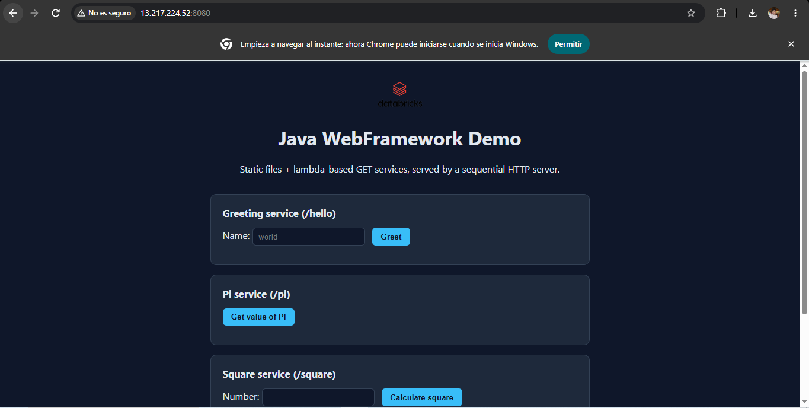
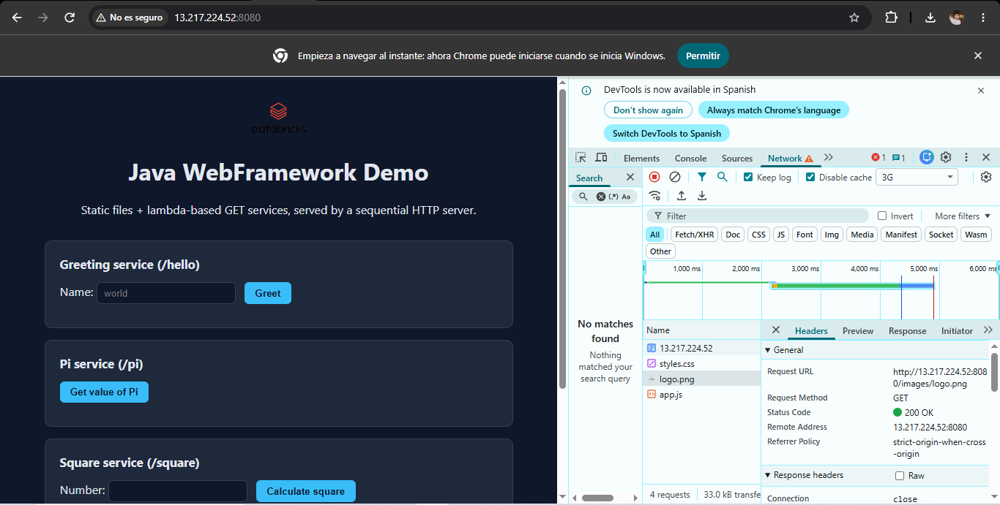
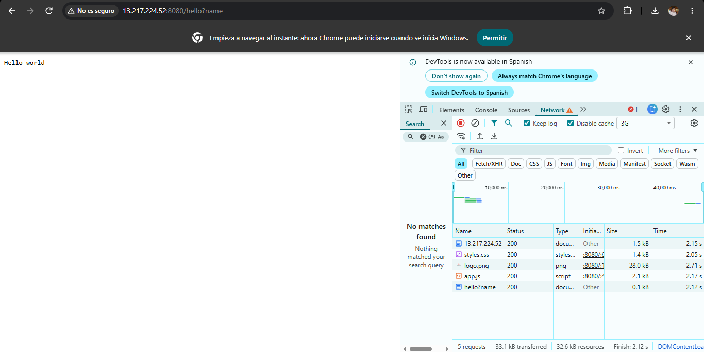
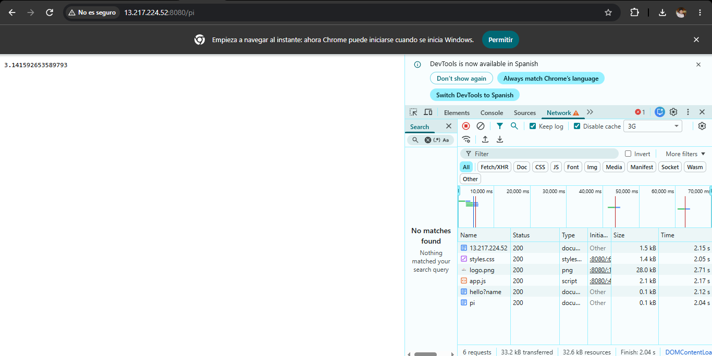
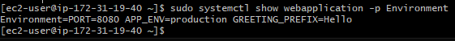
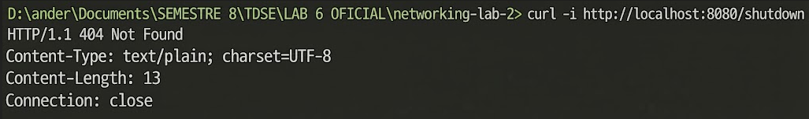
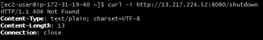

# Java WebFramework — A Maintainable Application Server

## Project description

This project evolves the sequential HTTP server built in the previous lab into a small
**application server** (a lightweight web framework): instead of hardcoding every dynamic route
inside the server's connection loop with `if/else`, developers now register HTTP GET services
as **Java lambda functions**. The framework:

- Serves static resources (HTML, CSS, JavaScript, images) from a configurable static-files root.
- Lets an application register GET routes with `get(path, (req, resp) -> ...)`.
- Extracts query-string parameters through `req.getValue("name")`.
- Falls back to static files when no dynamic route matches, and returns `404` when nothing matches.
- Reads deployment-specific configuration (port, greeting prefix, environment, static files path)
  from environment variables instead of hardcoding them.
- Supports a graceful, sequential shutdown through a `/shutdown` route, available only when
  `APP_ENV=development`.
- Remains strictly **sequential**: one connection is fully processed (accepted, read, dispatched,
  answered, closed) before the next one is accepted. There are no threads, pools, or asynchronous
  server-side execution.

The previous lab's server (`co.edu.escuelaing.webapplication.webapplication.Webapplication`, with
its hardcoded `if/else` routes) is kept untouched in the repository as the deliverable of that
earlier stage; it is not used by this lab and is not started by default.

## Required framework API

```java
import static co.edu.escuelaing.webframework.WebFramework.*;

public class Application {

    public static void main(String[] args) throws Exception {

        staticfiles("/webroot");

        get("/hello", (req, resp) -> {
            String name = req.getValue("name");
            if (name == null || name.isBlank()) {
                name = "world";
            }
            return "Hello " + name;
        });

        get("/pi", (req, resp) -> String.valueOf(Math.PI));

        start();
    }
}
```

Adding a new route (e.g. `/square`) never requires modifying the server's connection-processing
loop — only registering one more `get(...)` call.

## Architecture

### Diagram

```
                     ┌───────────────────────────┐
                     │          Browser           │
                     │  (HTML + fetch, async JS)  │
                     └─────────────┬───────────────┘
                                   │ HTTP GET
                                   ▼
                     ┌───────────────────────────┐
                     │        HttpServer          │  <- accepts one connection at a time,
                     │  (ServerSocket + loop)     │     parses method/path/query string
                     └──────┬──────────────┬───────┘
                            │              │
                 dynamic    │              │  nothing matched
                 route      ▼              ▼
                 ┌────────────────┐  ┌───────────────────────┐
                 │     Router      │  │   StaticFileService    │
                 │ path -> Service │  │  webroot/ (or          │
                 │ (lambda)        │  │  STATIC_FILES_PATH)    │
                 └────────┬────────┘  └───────────┬────────────┘
                          │                        │
                          ▼                        ▼
                 ┌─────────────────┐      ┌─────────────────┐
                 │ Application     │      │  404 Not Found   │
                 │ lambda handler  │      │  (if no file)    │
                 │ (Request,       │      └─────────────────┘
                 │  Response)      │
                 └─────────────────┘

Application (registers routes) → WebFramework (get/staticfiles/start/stop)
    → Router (path → lambda) + HttpServer (sockets, parsing, responses)
        → StaticFileService (fallback for static resources)
```

### Responsibilities of the main components

| Component | Responsibility |
|---|---|
| `Application` (`co.edu.escuelaing.app`) | Registers routes and reads its own configuration from environment variables. Knows nothing about sockets. |
| `WebFramework` | Public facade: `staticfiles()`, `get()`, `start()`/`start(port)`, `stop()`. The only class an application developer needs to import. |
| `Router` | Maps an HTTP method + path to the registered lambda (`Service`). Adding a route never touches the server loop. |
| `HttpServer` | Accepts connections sequentially, parses the request line and query string, asks the `Router` for a match, falls back to `StaticFileService`, and writes the HTTP response. Implements the graceful shutdown flag. |
| `Request` / `Response` | Represent HTTP data: `Request.getValue(name)` reads a query-string parameter; `Response` lets a lambda customize the status code and content type before the framework serializes the body. |
| `StaticFileService` | Serves static resources: by default from the classpath (`src/main/resources/webroot`, bundled inside the jar); if `STATIC_FILES_PATH` is set, from that folder on disk instead. Rejects `..` segments to avoid resource-root escape. |

### Required architecture metaphor: the office building

| Building metaphor | Framework component |
|---|---|
| Building entrance and receptionist | `HttpServer`: accepts every visitor (connection) one at a time, reads what they are asking for, and decides where to send them. |
| Directory in the lobby | `Router`: looks up which office (lambda) should handle a given request path. |
| Individual offices | The lambda handlers registered with `get(...)`: each one implements one specific service (`/hello`, `/pi`, `/square`, `/server-time`). |
| Document archive | `StaticFileService`: hands out the building's fixed documents (HTML, CSS, JS, images) as-is, without asking anyone to "do work". |
| Building configuration board | Environment variables (`PORT`, `GREETING_PREFIX`, `APP_ENV`, `STATIC_FILES_PATH`): set once per building (per deployment), never hardcoded into an office's behavior. |
| Closing procedure | Graceful shutdown (`/shutdown`, dev only): the receptionist finishes serving the visitor currently at the desk, sends them off, and only then locks the front door — nobody is left mid-conversation. |

### Why this architecture is maintainable

| Principle | Application in this lab |
|---|---|
| Separation of concerns | `HttpServer` only knows sockets and HTTP framing; it never knows what `/hello` or `/square` do. |
| Modularity | Routing (`Router`), request/response abstractions, and static files (`StaticFileService`) are independent classes. |
| Low coupling | A new `get(...)` call in `Application` never requires editing `HttpServer`. |
| High cohesion | Each class has one job: `Router` matches paths, `StaticFileService` reads files, `HttpServer` handles sockets. |
| Abstraction | The application developer calls `get()`/`staticfiles()`/`start()` without managing a single `Socket`. |
| Externalized configuration | `PORT`, `GREETING_PREFIX`, `APP_ENV`, `STATIC_FILES_PATH` are read from the environment, never hardcoded. |
| Extensibility | New services are added by registering more lambdas, not by editing the connection loop. |
| Testability | `Router`, `Request`, `StaticFileService`, and the request-line/query-string parsing in `HttpServer` are unit-tested without opening real sockets. |
| Operational maintainability | The exact same jar runs locally (`PORT` defaults to `8080`) and in the cloud (`PORT` injected by the platform). |

**Before → After**

```
Before (previous lab)                       After (this lab)
HTTP Server                                 HTTP Server → Router → Lambda handlers
 ├── Socket management                                │        ├── /hello
 ├── HTTP parsing                                     │        ├── /pi
 ├── Static files                                     │        └── Future endpoints
 ├── /greeting implementation (if/else)                └── StaticFileService
 ├── /square implementation (if/else)
 └── Every future route (more if/else)
```

## Project structure

```
networking-lab-2/
├── pom.xml
├── deploy/
│   └── webapplication.service                # systemd unit for the cloud deployment
├── public/                                   # previous lab's static resources (kept as-is)
├── src/
│   ├── main/java/co/edu/escuelaing/
│   │   ├── webframework/                     # the framework
│   │   │   ├── WebFramework.java             # staticfiles(), get(), start(), stop()
│   │   │   ├── HttpServer.java               # sequential connection loop
│   │   │   ├── Router.java                   # path -> lambda
│   │   │   ├── Service.java                  # (Request, Response) -> String
│   │   │   ├── Request.java / Response.java
│   │   │   └── StaticFileService.java
│   │   ├── app/
│   │   │   └── Application.java              # example application using the framework
│   │   └── webapplication/webapplication/
│   │       └── Webapplication.java           # previous lab's server, kept for reference
│   ├── main/resources/webroot/               # static resources served by the new framework
│   │   ├── index.html
│   │   ├── app.js
│   │   ├── styles.css
│   │   └── images/logo.png
│   └── test/java/co/edu/escuelaing/
│       ├── webframework/                     # unit tests for the framework
│       └── webapplication/webapplication/    # previous lab's tests, kept as-is
```

## Prerequisites

- **Java 21** (JDK). Check with `java -version`.
- **Maven 3.9+**. Check with `mvn -version`.

## Build and run locally

```bash
git clone https://github.com/Anderfg13/networking-lab-2.git
cd networking-lab-2
mvn clean package
```

This compiles the framework and the example application, runs the unit tests, and produces
`target/webapplication.jar` (its manifest points to `co.edu.escuelaing.app.Application`, so
`java -jar` runs the new framework-based app, not the previous lab's server).

Run it:

```bash
java -jar target/webapplication.jar                 # PORT defaults to 8080, APP_ENV to development
PORT=8081 java -jar target/webapplication.jar        # explicit port
GREETING_PREFIX=Hola PORT=8081 java -jar target/webapplication.jar
APP_ENV=production PORT=8081 java -jar target/webapplication.jar   # disables /shutdown
```

Then open `http://localhost:<port>/`.

To run the previous lab's server instead (kept for reference, not part of this lab's grading):

```bash
java -cp target/webapplication.jar co.edu.escuelaing.webapplication.webapplication.Webapplication
```

## Environment variables

| Variable | Purpose | Local default | Used by |
|---|---|---|---|
| `PORT` | HTTP server port | `8080` | `WebFramework.start()` |
| `GREETING_PREFIX` | Message used by the `/hello` route | `Hello` | `Application` |
| `APP_ENV` | Execution environment (`development` / `production`) | `development` | `Application` — gates registration of `/shutdown` |
| `STATIC_FILES_PATH` | Optional external folder to serve static files from, overriding the bundled classpath `webroot` | not set (uses the jar's `webroot`) | `StaticFileService` |

No credentials, tokens, or secrets are configured or committed for this application.

## Routes

| Route | Method | Query parameter | Example | Result |
|---|---|---|---|---|
| `/` | GET | — | `/` | Serves `webroot/index.html` |
| `/app.js`, `/styles.css`, `/images/logo.png` | GET | — | `/images/logo.png` | Static resources, served as bytes with the correct `Content-Type` |
| `/hello` | GET | `name` (optional) | `/hello?name=Pedro` | `<GREETING_PREFIX> Pedro` (defaults to `world` if missing) |
| `/pi` | GET | — | `/pi` | The value of `Math.PI` |
| `/square` | GET | `number` | `/square?number=4` | `{"number":4.0,"square":16.0}`; `400` if missing or not numeric |
| `/server-time` | GET | — | `/server-time` | `{"serverTime":"<ISO-8601>"}` |
| `/shutdown` | GET | — | `/shutdown` | Only registered when `APP_ENV=development`; stops the server gracefully after answering. `404` in production. |
| any other path | GET | — | `/unknown` | `404 Not Found` |
| any path | non-GET | — | `POST /hello` | `405 Method Not Allowed` |

## Example web application

`src/main/resources/webroot/index.html`, `app.js`, and `styles.css` (served through
`staticfiles("/webroot")`) demonstrate the framework: one HTML page, one CSS file, one image
(`images/logo.png`), and a JavaScript client (`app.js`) that calls `/hello`, `/pi`, `/square`,
and `/server-time` with `fetch()` — five asynchronous calls in total, satisfying the "at least
one asynchronous browser call" requirement several times over.

## Tests performed

Unit tests (`mvn test`), without opening real sockets:

- `RouterTest`: a registered GET route resolves to its lambda; an unregistered path resolves to
  `null` (static-file fallback); a non-GET method never resolves.
- `RequestTest`: `getValue()` returns a present parameter and `null` for a missing one.
- `StaticFileServiceTest`: an existing classpath resource resolves with the right content type; a
  missing resource and a `..` path-traversal attempt both resolve to `null`; content-type mapping
  by extension.
- `HttpServerTest`: request-path/query-string splitting, query-parameter decoding (including
  URL-encoded values and multiple parameters), and HTTP header construction.

Manual end-to-end verification with `curl` against the packaged jar (`java -jar
target/webapplication.jar`):

- `GET /hello?name=Pedro` → `200`, dynamic response from the lambda, honoring `GREETING_PREFIX`.
- `GET /hello` (no `name`) → `200`, falls back to `world` without failing.
- `GET /hello?name=Pedro&language=en` → multiple query parameters read correctly; the unused one
  does not break anything.
- `GET /pi`, `GET /square?number=4`, `GET /server-time` → `200`, dynamic responses.
- `GET /square` (missing `number`) → `400 Bad Request`.
- `GET /`, `GET /app.js`, `GET /images/logo.png` → `200`, static resources with correct
  `Content-Type` (including a binary image, byte-for-byte).
- `GET /unknown` → `404 Not Found`.
- `POST /hello` → `405 Method Not Allowed`.
- `GET /shutdown` with `APP_ENV=development` → `200` with a confirmation message, the process
  then exits its main loop and stops accepting new connections (verified: a subsequent request
  gets connection refused).
- `GET /shutdown` with `APP_ENV=production` → `404 Not Found` (the route is never registered).

> Evidence: see [Evidence and results](#evidence-and-results) below for the screenshots to attach.

## Deploying to AWS EC2

> This section documents the procedure to deploy the built artifact (`target/webapplication.jar`,
> which already bundles `webroot/` inside it). Creating/configuring the EC2 instance itself must
> be done from your own AWS account; the steps below reuse the same instance/security-group setup
> as the previous lab.

1. **Launch or reuse the EC2 instance**: a Linux AMI (e.g. Amazon Linux 2023), default public
   VPC/subnet.
2. **Security group**: allow the administration port (22, restricted to your IP, or use Session
   Manager) and the application port (`8080`, or whichever `PORT` you configure) as inbound TCP
   rules — this is what makes the server reachable from outside `localhost`.
3. **Connect** to the instance (Session Manager, EC2 Instance Connect, or SSH).
4. **Install JDK 21**:
   ```bash
   sudo dnf install -y java-21-amazon-corretto
   ```
5. **Transfer the artifact** (from your local machine — the jar already contains `webroot/`, so
   no separate `public/` copy is needed for this lab's app):
   ```bash
   scp target/webapplication.jar ec2-user@<public-ip>:/home/ec2-user/webapplication/
   ```
6. **Verify manually before wiring up systemd**:
   ```bash
   PORT=8080 APP_ENV=production java -jar webapplication.jar &
   curl http://localhost:8080/pi
   curl http://localhost:8080/hello?name=EC2
   curl -i http://localhost:8080/shutdown   # must be 404 in production
   ```
7. **Configure as a managed service** (`deploy/webapplication.service` already sets
   `APP_ENV=production` and `PORT=8080`):
   ```bash
   sudo cp deploy/webapplication.service /etc/systemd/system/webapplication.service
   sudo systemctl daemon-reload
   sudo systemctl enable --now webapplication
   sudo systemctl status webapplication
   journalctl -u webapplication -f
   ```
8. **Test from your own computer**: `http://<instance-public-ip>:8080/`.
9. To stop it: `sudo systemctl stop webapplication` (the `/shutdown` route is intentionally
   unavailable in this configuration, since `APP_ENV=production`).

**Cloud platform used:** AWS EC2 (Amazon Linux, systemd-managed process).

**Public deployment URL:** [http://13.217.224.52:8080/](http://13.217.224.52:8080/)

**Example URLs (live):**

- Static page: [http://13.217.224.52:8080/](http://13.217.224.52:8080/)
- Static image: [http://13.217.224.52:8080/images/logo.png](http://13.217.224.52:8080/images/logo.png)
- REST endpoint 1: [http://13.217.224.52:8080/hello?name=Cloud](http://13.217.224.52:8080/hello?name=Cloud)
- REST endpoint 2: [http://13.217.224.52:8080/pi](http://13.217.224.52:8080/pi)
- REST endpoint 3: [http://13.217.224.52:8080/square?number=4](http://13.217.224.52:8080/square?number=4)
- REST endpoint 4: [http://13.217.224.52:8080/server-time](http://13.217.224.52:8080/server-time)
- `/shutdown` disabled in production: [http://13.217.224.52:8080/shutdown](http://13.217.224.52:8080/shutdown) → `404 Not Found`

## Evidence and results

**Cloud deployment**

| | |
|---|---|
|  |  |
|  |  |

**Environment variables on the instance (no secrets)**



**Graceful shutdown**

| Local, `APP_ENV=development` | Cloud, `APP_ENV=production` |
|---|---|
|  |  |

## Verification checklist

- [x] The project builds successfully with Maven (`mvn clean package`).
- [x] The server serves HTML, CSS, JavaScript, and an image.
- [x] At least two GET lambda routes work locally (`/hello`, `/pi`, plus `/square` and
      `/server-time`).
- [x] Query values can be read from the request (`req.getValue(...)`).
- [x] Unknown resources return HTTP `404`.
- [x] The application reads `PORT` from the environment.
- [x] At least one additional environment variable is used (`GREETING_PREFIX`, `APP_ENV`,
      `STATIC_FILES_PATH`).
- [x] `/shutdown` stops the local server gracefully.
- [x] The server remains sequential (no threads/pools).
- [x] The application is deployed publicly to the cloud — [http://13.217.224.52:8080/](http://13.217.224.52:8080/).
- [x] The cloud deployment uses `APP_ENV=production` (set in `deploy/webapplication.service`).
- [x] The production deployment does not expose `/shutdown` (returns `404`, see evidence).
- [x] The README contains all required evidence screenshots.

## Known limitations

- The server is **strictly sequential**: no threads, pools, or concurrent request handling.
- It only supports the `GET` method; any other method gets `405`.
- Routes are matched by exact path only (no path parameters or wildcards).
- It is not a production-grade HTTP server: no keep-alive, HTTPS, compression, or full HTTP
  header handling.

## Author and acknowledgments

**Author:** Anderson Fabian Garcia Nieto.

This project was developed for the "Building and Deploying a Maintainable Application Server"
lab for the Telematics/TDSE course, evolving the sequential HTTP server from the previous lab.
Development was assisted by Claude (Anthropic) as a conceptual and implementation tutor.
